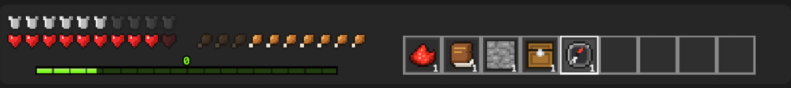

# BlockHUD

A Claude Code mod that draws a Minecraft-style HUD above the prompt: armor, hearts, food, XP and a hotbar of the tools Claude has used.



| Row | Shows |
| --- | --- |
| Armor | Weekly (7-day) usage limit left |
| Hearts | Context window left |
| Food | 5-hour usage limit left |
| XP | Turns finished this session, a level every 5 |
| Hotbar | Tools used this turn, with a count per slot. The running tool's slot is highlighted. Between turns it shows last turn's tools, dimmed. |

Hover any row or slot to see what it means and its exact value. A row is hidden while Claude Code reports no figure for it.

## Requirements

- The Claude Code desktop app, in the Code tab. The HUD is drawn as SVG, which the terminal can't show, so in the terminal the mod draws nothing.
- Claude Code 2.1.288 or newer, with plugin function hooks (early access).

## Install

In Claude Code, add this repo as a marketplace once, then install the mod from it:

```
/plugin marketplace add ssobii2/BlockHud
/plugin install blockhud@blockhud
```

Or from a shell:

```sh
claude plugin marketplace add ssobii2/BlockHud
claude plugin install blockhud@blockhud
```

Start a new session and the HUD appears above the prompt.

### Update

```
/plugin marketplace update blockhud
/plugin update blockhud@blockhud
```

### Uninstall

```
/plugin uninstall blockhud@blockhud
/plugin marketplace remove blockhud
```

## Hotbar items

| Tools | Item |
| --- | --- |
| Grep, Glob | Pickaxe |
| Read | Book |
| Edit, Write, NotebookEdit | Bricks |
| Bash | Redstone |
| WebSearch, WebFetch | Compass |
| Agent, Task | Emerald |
| Skill | Enchanted book |
| TodoWrite | Paper |
| Any MCP tool | Chest |
| Anything else | Stone |

The hotbar holds 9 slots, in the order tools were first used. Tools past the ninth are not shown.

## Privacy

BlockHUD makes no network requests, reads and writes no files, and stores nothing. It reads the session's usage figures from Claude Code and counts tool calls in memory. All state resets when the session ends.

A failure inside the mod never blocks a tool call.

## Troubleshooting

- **Nothing shows.** Check you're in the desktop app's Code tab, not the terminal, and that Claude Code is 2.1.288 or newer. Start a new session after installing.
- **Some rows are missing.** Each row only appears when Claude Code reports its figure. Armor and food need usage limits, which Claude Code may not report for every account type.

## Development

```sh
git clone https://github.com/ssobii2/BlockHud
cd BlockHud
claude --plugin-dir .
```

Checks:

```sh
claude plugin validate .
claude plugin test .
npx -p typescript tsc -p .
```

The types live in `.claude-plugin/types` (gitignored) and appear once Claude Code has loaded the mod.

| File | Purpose |
| --- | --- |
| `hooks/register.tsx` | Hooks: tracks usage, turns and tools, renders the HUD |
| `hooks/hud.ts` | Builds the stats and hotbar SVGs |
| `hooks/sprites.ts` | Generated pixel-art sprites |

## Contributing

Issues and pull requests are welcome at [github.com/ssobii2/BlockHud](https://github.com/ssobii2/BlockHud/issues). Please run the checks above before opening a pull request.

## Credits and licenses

- Code: MIT, see [`LICENSE`](LICENSE).
- Sprites are from [CodeCraft](https://github.com/mkpvishnu/claude-mods) by mkpvishnu, MIT, see [`LICENSE-CODECRAFT`](LICENSE-CODECRAFT).
